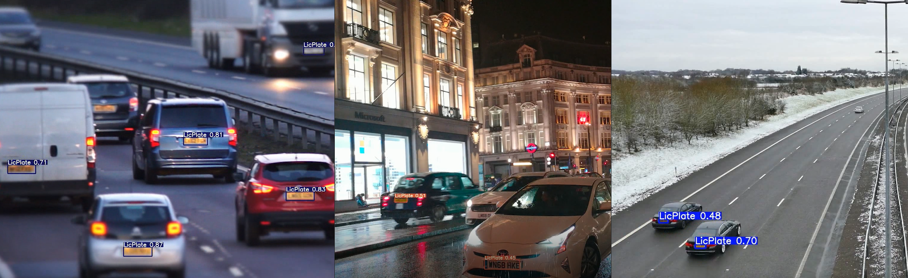

Video [Source](https://unsplash.com/) and watch complete demo [here](https://drive.google.com/drive/folders/1mK8vSS7bcvb-qREqdKwkM6qlK71sjp0-?usp=sharing) 

# Automatic_License_Plate_Detector

The goal of this repository is to push the limits on License Plate Detection for it to work in adverse environments, different weather conditions
and make it deployable on different devices. This problem exists from a long time 
and a lot of solutions have been proposed to solve it. Some work well, some dont 
but there is always room for improvement.    

## Data

Data used to train this model include youtube videos containing traffic surveillance. Each and every frame was manually annotated with the help of CVAT tool. Around 8000 frames were annotated along with that 5000 images from CCPD2019 dataset were used and was split into 70%-15%-15%  (train-val-test) dataset. Images in data contains all sorts of noise including blur and weather conditions. 
```
@inproceedings{xu2018towards,
  title={Towards End-to-End License Plate Detection and Recognition: A Large Dataset and Baseline},
  author={Xu, Zhenbo and Yang, Wei and Meng, Ajin and Lu, Nanxue and Huang, Huan},
  booktitle={Proceedings of the European Conference on Computer Vision (ECCV)},
  pages={255--271},
  year={2018}
}
```


## My System Specifications and Model Performance

Before jumping to the model performance, let have a look at my system specification 
so that you can make a better estimation on its limits for it to work in real time 
environment. 

#### System Specification:-

|   Description    |                                    Specifications                                     |
| :--------------: | :-----------------------------------------------------------------------------------: |
|    Processor     | Intel(R) Core(TM) i5-8300H CPU @ 2.30GHz, 2304 Mhz, 4 Core(s), 8 Logical Processor(s) |
|       RAM        |                                         16GB                                          |
| Operating System |                                    Windows 10 Home                                    |
|       GPU        |                              NVIDIA GeForce GTX 1050 4GB                              |
|       CUDA       |                                         10.2                                          |

#### Detector Model Performance

| Model                                                                                                   | Precision | Recall | mAP@0.5 | mAP@.5:.95 | FPS<sub>MYSPECS</sub> | params |
| ------------------------------------------------------------------------------------------------------- | --------- | ------ | ------- | ---------- | --------------------- | ------ |
| YOLOv5-s ([ckpt](https://drive.google.com/drive/folders/1mK8vSS7bcvb-qREqdKwkM6qlK71sjp0-?usp=sharing)) | 0.7536    | 0.9864 | 0.9742  | 0.73       | 42                    | 7.1M   |
| YOLOv5-m ([ckpt](https://drive.google.com/drive/folders/1mK8vSS7bcvb-qREqdKwkM6qlK71sjp0-?usp=sharing)) | 0.7851    | 0.964  | 0.9672  | 0.7297     | 30                    | 22.0M  | 

Detector models specified above are FP16 models due to which they are small in size and can be deployed in any devices. Models performance can be further improved by training the pretrained weights on more application specific data. With that the models are still open to improvements.
 
