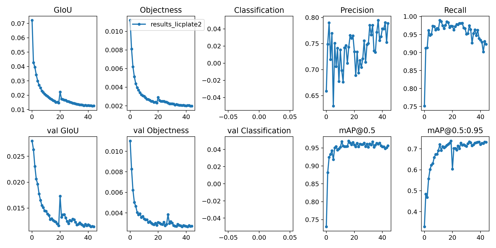
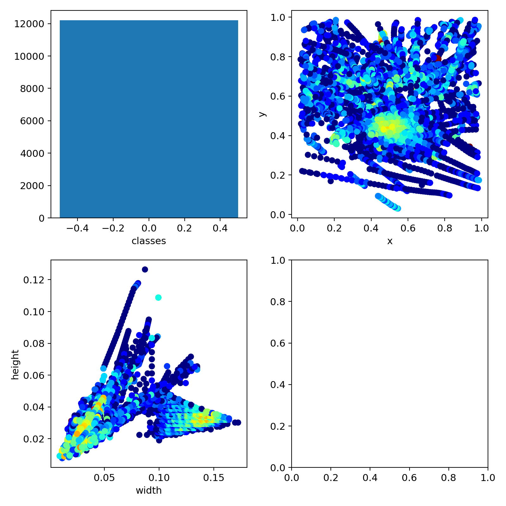

# YOLO-v5

Yolo-V5 is an object detection model written in PyTorch by [glenn-jocher](https://github.com/glenn-jocher)

## Requirements

Python 3.7 or later with all `requirements.txt` dependencies installed, including `torch >= 1.5`. To install run:
```bash
$ pip install -U -r requirements.txt
```


## Getting Started

Get the models from [here](https://drive.google.com/drive/folders/1mK8vSS7bcvb-qREqdKwkM6qlK71sjp0-?usp=sharing) and store them in ```./weights``` folders.

To train the model use this 
```bash
$ python train.py --img 640 --batch 16 --epochs 10 --data ./data.yaml --cfg ./models/yolov5s.yaml --weights ./weights/yolov5s.pt
```


For detecting/testing on custom video or image use 
```bash
$ python detect.py --source test.mp4 --weights ./weight/licplate.pt --show-img
```
or any of your choice of source
```bash
$ python detect.py --source file.jpg  # image 
                            file.mp4  # video
                            ./dir  # directory
                            0  # webcam
                            rtsp://170.93.143.139/rtplive/470011e600ef003a004ee33696235daa  # rtsp stream
                            http://112.50.243.8/PLTV/88888888/224/3221225900/1.m3u8  # http stream
```

## Results

#### Train logs

| Yolov5-s | Yolov5-m |
| :------: | :-------:|
|  |  |

 


 


