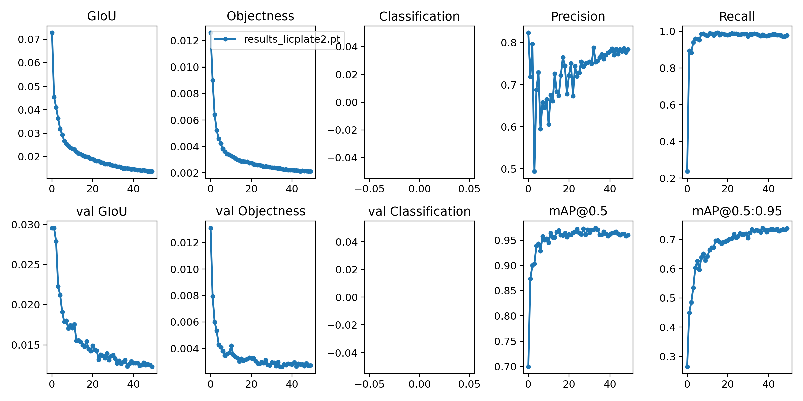

# YOLO-v5

Yolo-V5 is an object detection model written in PyTorch by [glenn-jocher](https://github.com/glenn-jocher)

## Getting Started

To train the model use this 
```
python train.py --img 640 --batch 16 --epochs 10 --data ./data.yaml --cfg ./models/yolov5s.yaml --weights ./weights/yolov5s.pt
```
more on README.md

For detecting/testing on custom video or image use 
```
python detect.py --source test.mp4 --weights ./weight/licplate.pt --show-img
```
again more on README.md

## Results

#### Train logs




 


